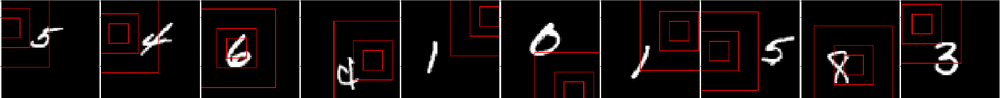

# Recurrent Visual Attention Model (RAM)
 - A TensorFlow implementation of [Recurrent Models of Visual Attention](https://arxiv.org/abs/1406.6247) (NIPS 14).
 - The the model from the paper:
 
 - For image classification/recognition tasks, this model will look at different location of the original image for several steps before making the final prediction. Besides reduces the computational complexity, this type of model also privodes more explainable results.
 - The core network is an RNN. It takes the representation from glimpse network and previous hidden state as input and then produces the new hidden state.
 - The location network and action network takes the new hidden state of the RNN as input and produce new location for the glimpse network to extract the new representation and the new action, respectively.
 - This repository includes experiments on the original MNIST and the translated MNIST dataset. The classification accuracy on the translated MNIST dataset is 97.82%.
 
## Requirements
- Python 3.3+
- [Tensorflow 1.8+](https://www.tensorflow.org/)

## Implementation Details
- The RAM model is defined in [`lib/model/ram.py`](lib/model/ram.py).
- An example of MNIST dataset classification is in [`example/mnist.py`](example/mnist.py).
- The action network, core network and glimpse network are trained by the classification cross entropy loss.
- The location network is trained through the algorithm [REINFORCE](http://www-anw.cs.umass.edu/~barto/courses/cs687/williams92simple.pdf).
- The reward baseline network is trained by the MSE loss between baseline and reward.  

## Result
### Centered MNIST

Hyperparameters

*name* | *value* |*name* | *value* |
:---| :---| :--- | :---|
step | 6 |
smallest glimpse | 8 |glimpse scales | 1 |
location std |0.03| pixel to unit width | 12 |
Batch Size | 128 |Max Epoch | 1000 |
Learning Rate <td colspan=3>1e-3 (initial) and decay with 0.97 for every 500 steps |

- Locations of glimpse at different steps


### Translated MNIST (accuracy 97.82%)

Hyperparameters

*name* | *value* |*name* | *value* |
:---| :---| :--- | :---|
image size | 60 x 60 | step | 6 |
smallest glimpse | 12 |glimpse scales | 3 |
location std |0.03| pixel to unit width | 26 |
Batch Size | 128 |Max Epoch | 2000 |
Learning Rate <td colspan=3>1e-3 (initial) and decay with 0.97 for every 500 steps |

- Locations of glimpse at different steps


## Usage
### 
- Download the MNIST dataset from [here](http://yann.lecun.com/exdb/mnist/).
- Setup path in [`example/read_mnist.py`](example/read_mnist.py): `DATA_PATH ` is the directory to put MNIST dataset.
- Setup path in [`example/mnist.py`](example/mnist.py): `SAVE_PATH  ` is the directory to save trained models during training. `RESULT_PATH ` is the directory to save prediction results.

### Argument
Run the script [`examples/read_mnist.py`](examples/read_mnist.py) to train and test the model. Here are all the arguments:

* `--train`: Train the model.
* `--eval`: Evaluate the model.
* `--predict`: Get output images with glimpse positions step by step on samples from testing set using the trained model.
* `--batch`: Batch size. Default: `128`.
* `--epoch`: Max number of epochs. Default: `1000`.
* `--lr`: Initial learning rate. Default: `1e-3`.
* `--load`: The epoch ID of trained model to be restored for evaluation or prediction.
* `--dataset`: Dataset used for experiment. Default: `center`. `center` for original MNIST. `translate` for translated MNIST with size 60 x 60.
* `--step`: Number of times the model looking at images before the final prediction. Default: `1`
* `--glimpse`: Size of smallest glimpse. Default: `12`
* `--scale`: Number of glimpse scales. Default: `3`.
* `--std`: Standard deviation for sampling glimpse locations. Default: `0.11`.
* `--pixel`: Unit width in the coordinate system of the model to the number of pixels. Default: `26`.

### Train the model
- Go to `examples/`, then run

```
python --train --dataset DATASET
```
- `--dataset center` for original MNIST. `--dataset translate` for translated MNIST with size 60 x 60.

### Evaluate the model
- Go to `examples/`, then run

```
python --eval --dataset DATASET --load RESTORE_ID
```
- The accuarcy on testing set will be printed out.

## Reference implementation:
- http://torch.ch/blog/2015/09/21/rmva.html
- https://github.com/jlindsey15/RAM
- https://github.com/jtkim-kaist/ram_modified
