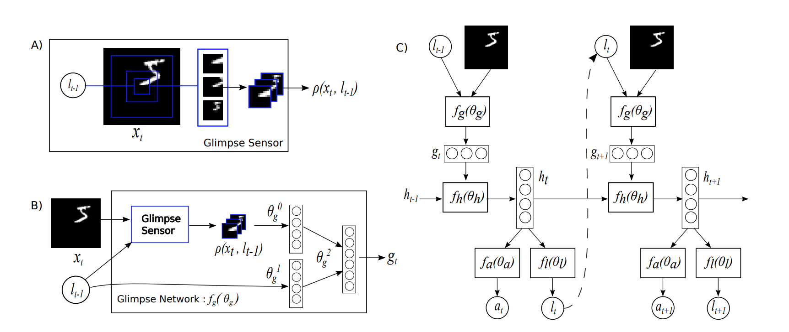
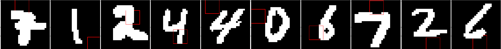

# Recurrent Visual Attention Model (RAM)
 - A TensorFlow implementation of [Recurrent Models of Visual Attention](https://arxiv.org/abs/1406.6247) (NIPS 14)
 - The the model from the paper:
 
 - The core network is an RNN. It takes the representation from glimpse network and previous hidden state as input and then produces the new hidden state.
 - The glimpse network and action network takes the new hidden state as input and produce new glimpse representation and action.
 
## Requirements
- Python 3.3+
- [Tensorflow 1.8+](https://www.tensorflow.org/)
- [TensorCV](https://github.com/conan7882/DeepVision-tensorflow)

## Implementation Details
- The RAM model is defined in [`lib/model/ram.py`](lib/model/ram.py).
- An example of MNIST dataset classification is in [`example/pre_trained.py`](example/mnist.py).
- The action network, core network and glimpse network are trained by the classification cross entropy loss.
- The location network is trained by [REINFORCE](http://www-anw.cs.umass.edu/~barto/courses/cs687/williams92simple.pdf).
- The reward baseline network is trained by the MSE loss between baseline and reward.  

## Result
### Centered MNIST

### Translated MNIST

## Reference implementation:
- https://github.com/jlindsey15/RAM
- https://github.com/jtkim-kaist/ram_modified
